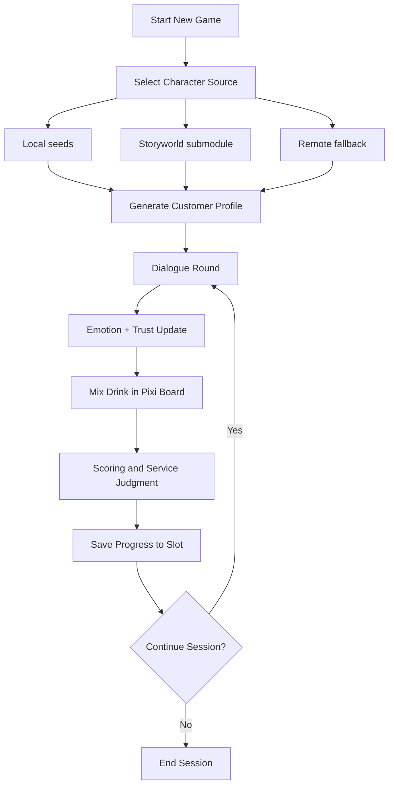
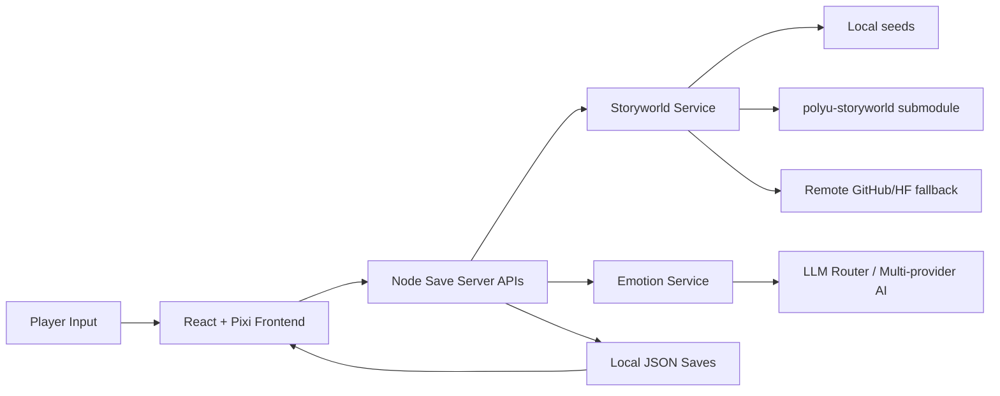

# Resonant Sips

**English** | [简体中文](README.zh-CN.md)

Resonant Sips is an interactive cyberpunk bartending narrative game.  
Players read customers, infer hidden emotions, and mix drinks that influence trust, story progression, and outcomes.

## Project Snapshot

- **Integrated novelty**: Multi-provider LLM routing + 8-emotion inference + Pixi interactive mixing + Storyworld character ingestion are integrated into one playable loop (not isolated demos).
- **Runnable repository**: `npm run dev` starts client+server, `.env.example` documents required configuration, and `npm run build` provides production output.
- **Documented gameplay workflow**: end-to-end gameplay/voiceover walkthrough is documented in `public/preview/gameplay-voiceover-guide-en.md`.
- **Course ecosystem integration**: integrates `venetanji/polyu-storyworld` (submodule + remote fallback) and MCP-style endpoints under `/api/mcp/...`.

Key reference paths:

- `README.md` (run/config/workflow)
- `README.zh-CN.md` (Chinese mirror)
- `DOC/DESIGN_PLAN.md` (implementation-aligned plan)
- `DOC/development-trace.md` (repository-visible collaboration trace)
- `server/storyworld-service.mjs`, `server/save-server.mjs`, `server/emotion-service.mjs`

## Academic Integrity and Copyright

- Asset provenance register: `ASSET_ATTRIBUTION.md`
- Ethics and usage scope: `ETHICS_AND_USE.md`
- Character seed compliance requirements: `seeds/characters/README.md`
- Storyboard role reference policy: role IDs follow `xxxxg` format; for each shown role, cite Storyworld character source and dataset source.

Attribution practice:

- Keep all visual assets for coursework continuity, and disclose references by shown role ID.
- If original creator name is unknown, use ID-level reference: `Role ID + upstream URL + access date + non-commercial coursework note`.

## Implementation Highlights

### 1) Integrated Technical Novelty

This project combines multiple state-of-the-art capabilities in one playable loop:

- Multi-provider LLM routing (Gemini / DeepSeek / OpenAI-compatible endpoints).
- Optional remote TTS with strict transcript-to-text sync guard.
- Character ingestion from Storyworld YAML and fallback remote sources.
- 8-axis emotion modeling (Plutchik-inspired) linked to dialogue and mixing.
- Real-time interactive mixing board rendered with Pixi.js.

What is original in this repository is the integration logic: Storyworld character data, emotion inference, dialogue behavior, and bartending mechanics are stitched into one coherent gameplay system rather than isolated demos.

### 2) Repository Engineering Quality

- The repository is runnable locally with documented setup.
- The full gameplay workflow is represented in code and docs (including voiceover demo guide).
- The project integrates the course ecosystem through `venetanji/polyu-storyworld` and MCP-style APIs.

### 3) Iterative Team Development

The project was developed through short iteration cycles across gameplay logic, AI integration, UI/asset polish, and documentation updates.  
Rather than shipping isolated experiments, the team repeatedly consolidated features into a stable playable loop, then refined reliability and presentation quality.  
Contribution history is visible in git commits from multiple members, with work spread across frontend interaction, backend services, assets, and writing.  
For a concise, auditable trace of where collaboration appears in the codebase, see `DOC/development-trace.md`.

### 4) Storyworld and MCP-style Usage

- Uses `venetanji/polyu-storyworld` as a git submodule and remote fallback source.
- Exposes and consumes HTTP MCP-style routes under `/api/mcp/...` for character lookup and emotion analysis.

## Tech Stack

- Frontend: React 18, Vite 5
- Rendering: Pixi.js 8
- Backend service: Node.js HTTP server (`server/save-server.mjs`)
- Data persistence: file-based JSON saves (`saves/`, `seeds/`)
- AI integration: OpenRouter/OpenAI-compatible endpoints, Gemini/DeepSeek config
- Character format parsing: YAML

## Prerequisites

- Node.js 18+
- npm 9+

## Setup

```bash
git clone <your-repo-url>
cd RESONANT-SIPS
npm install
```

Optional but recommended (for local Storyworld files):

```bash
git submodule update --init --recursive
```

## Environment Configuration

1. Copy `.env.example` to `.env.local`.
2. Fill your real API keys/endpoints in `.env.local`.
3. Keep `.env.local` private (already gitignored).

Core variables:

- `VITE_AI_PROVIDER` (`gemini` or `deepseek`)
- `VITE_GEMINI_API_KEY`, `VITE_GEMINI_MODEL`, `VITE_GEMINI_ENDPOINT`
- `VITE_DEEPSEEK_API_KEY`, `VITE_DEEPSEEK_MODEL`, `VITE_DEEPSEEK_ENDPOINT`
- `VITE_IMAGE_GEN_MODEL`, `VITE_IMAGE_GEN_ENDPOINT`
- `VITE_ENABLE_REMOTE_TTS`, `VITE_REMOTE_TTS_ENDPOINT`, `VITE_REMOTE_TTS_MODEL`
- `VITE_TTS_STRICT_TEXT_SYNC` (recommended `1`)
- `VITE_DISABLE_REMOTE_STORYWORLD_FALLBACK` (`1` = local-only character source)
- `VITE_DISABLE_REMOTE_PORTRAIT_FALLBACK` (`1` = disable remote portrait fetch)

Notes:

- If local Storyworld files are missing, the server can fallback to remote sources.
- Server-side AI-backed routes also read from root `.env.local`.

## Network Access Notes (CN/HK)

If you are in mainland China or some HK networks, you may need VPN because default configs can hit blocked/unstable domains:

- `openrouter.ai` (default LLM/TTS endpoint in `.env.example`)
- `generativelanguage.googleapis.com` (Google Gemini native endpoint)
- `api.github.com` / `raw.githubusercontent.com` (Storyworld YAML remote fallback)
- `huggingface.co` (Storyworld portrait dataset fallback)

To reduce VPN dependency:

1. Use DeepSeek endpoint in `.env.local` (`VITE_AI_PROVIDER=deepseek` + DeepSeek key).
2. Disable remote Storyworld fallback: `VITE_DISABLE_REMOTE_STORYWORLD_FALLBACK=1`.
3. Disable remote portrait fallback: `VITE_DISABLE_REMOTE_PORTRAIT_FALLBACK=1`.
4. Initialize local submodule assets: `git submodule update --init --recursive`.
5. Optional: disable remote TTS (`VITE_ENABLE_REMOTE_TTS=0`) if OpenRouter is blocked.

Copy-paste presets are documented in:

- `DOC/network-cn-hk-setup.md`

Profile switch commands:

- `npm run env:cnhk`
- `npm run env:global`

## Run Locally

Start frontend + save server together:

```bash
npm run dev
```

Useful split commands:

```bash
npm run dev:client
npm run dev:server
```

Default ports:

- Client (Vite): `http://localhost:5173`
- Save/API server: `http://127.0.0.1:3001`

Health check:

```text
GET http://127.0.0.1:3001/health
```

## Build

```bash
npm run build
npm run preview
```

## Path Safety Check

Before committing asset/file-structure changes, run:

```bash
npm run check:paths
```

Path policy document:

- `DOC/asset-structure-and-path-policy.md`

## Gameplay Workflow

Typical workflow represented in this repo:

1. Select/import character (local seeds / Storyworld / remote fallback).
2. Generate playable customer profile from character context.
3. Run dialogue + hidden emotion inference + trust progression.
4. Mix cocktail in Pixi interface (Body / Sweetness / Strength style axes).
5. Evaluate service outcome and persist progression to save slots.

### Gameplay Flow



### Logic / System Workflow



For narration script structure, see:

- `public/preview/gameplay-voiceover-guide-en.md`

## Storyworld and MCP-style Integration

- Storyworld source:
  - Submodule: `polyu-storyworld` (from `venetanji/polyu-storyworld`)
  - Local seeds: `seeds/characters/`
  - Remote fallback: GitHub raw/Hugging Face dataset paths in server services
- MCP-style HTTP endpoints (non-SDK MCP server):
  - `/api/mcp/character/get_by_name`
  - `/api/mcp/character/search`
  - `/api/mcp/emotion/analyze_character`

## Repository Structure (Key Paths)

- `src/`: pages, hooks, components, AI/gameplay logic
- `src/game/pixi/`: interactive mixing board and ambient scene
- `server/save-server.mjs`: save APIs + MCP-style routes
- `server/storyworld-service.mjs`: Storyworld loading/index/fallback
- `server/emotion-service.mjs`: emotion analysis service
- `scripts/`: dev orchestration and utility scripts
- `seeds/`: default game state and character seeds
- `saves/`: local runtime saves (gitignored content)
- `DOC/`: process and planning docs

## Validation Checklist (Manual)

- App launches at `http://localhost:5173`
- Save server responds on `/health`
- New game can load a Storyworld-linked character
- Dialogue and emotion panel update during play
- Mixing board interaction updates gameplay state
- Save slot data is written locally

## Current Limitations

- No `npm test` script yet (manual validation is primary).
- No GitHub Actions workflow configured yet.
- Encyclopedia entry point is currently feature-flagged off in app routing.
- Some older design docs describe aspirational Python/ComfyUI workflow not identical to current React/Node implementation.

## Security and Collaboration Notes

- Never commit real keys to tracked files.
- `.env*` secrets are gitignored.
- Share credentials with teammates only via private channels.

## Copyright Notice

The character library used in this project is sourced from the PolyU MSc IME course:
AI Tools for Creative Process and Transmedia (SD5976).

The original copyright and authorship of the characters belong to their respective creators.
Our use of these characters in this project constitutes derivative creation / secondary creation based on the course character library, and is intended solely for academic, learning, and presentation purposes.

This project does not claim ownership of the original character designs or narratives,
and fully respects the creative rights and intellectual property of the original authors.
